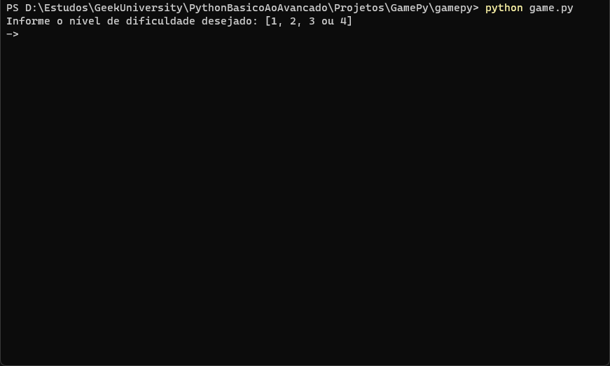

# GamePy

Um jogo simples de cálculos matemáticos para terminal, singleplayer e offline.

## Prévia

## Objetivo

Sintetizar conhecimentos sobre Python com o desenvolvimento de aplicações simples,
pois somente a prática levará ao caminho do aprendizado.

---

